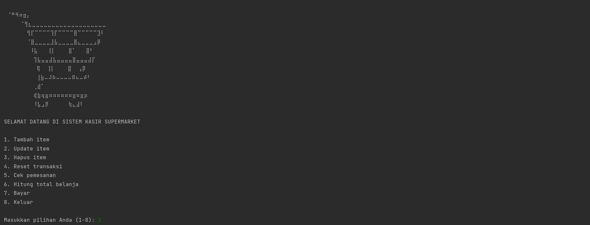
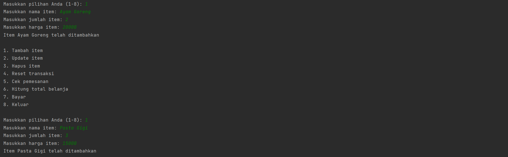
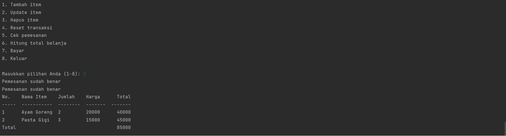
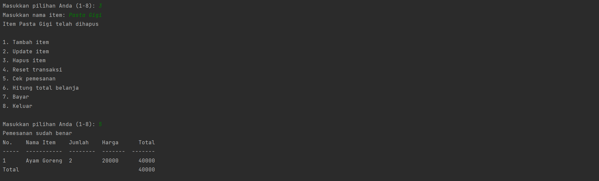
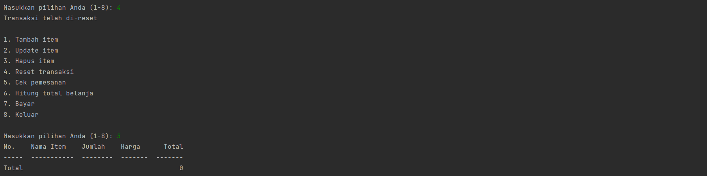
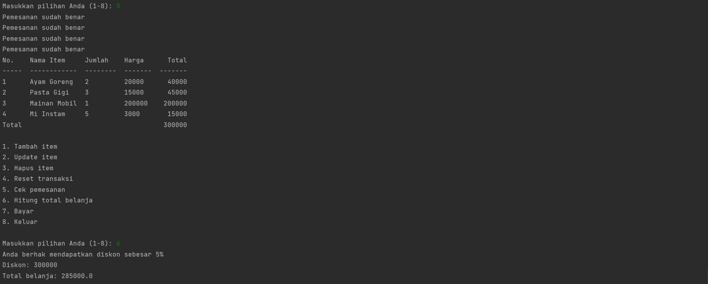
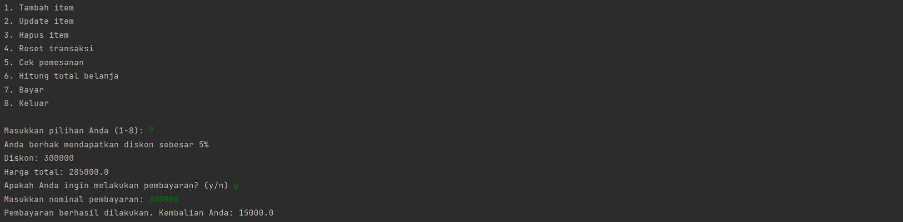

# Super Cashier Python Project - Pacmann

<p>&nbsp;</p>

## Latar Belakang Problem

Latar belakang masalah yang dihadapi oleh Andi adalah **kebutuhan untuk memperbaiki proses bisnis di supermarket miliknya**. Andi ingin membuat **sistem kasir *self-service*** agar *customer* bisa langsung memasukkan item yang dibeli, jumlah item yang dibeli, dan harga item yang dibeli. Hal ini dilakukan agar *customer* yang berada di luar kota juga bisa membeli barang dari supermarket itu.

Saran yang dapat diberikan untuk memecahkan masalah ini adalah dengan membuat program Super Cashier untuk memudahkan Andi dalam mengimplementasikan sistem kasir *self-service*.

<p>&nbsp;</p>

## Requirement and Objective
### Objectives:

- Membuat sistem kasir *self-service* di supermarket milik Andi
- Sistem kasir *self-service* tersebut dapat melakukan pemasukan item-item yang dibeli oleh *customer*, jumlah item yang dibeli, dan harga item yang dibeli
- *Customer* bisa melakukan pembelian barang dari supermarket meskipun tidak berada di kota tersebut
- Program ini akan mempermudah proses bisnis Andi dengan membuat sistem kasir *self-service*
- Program ini akan mempermudah *customer* dalam melakukan pembelian barang dengan cara yang lebih mudah dan cepat

### Requirements:

1. Modul `CSV` harus terinstall agar dapat melakukan transfer order history ke text file .csv
2. Modul `time` harus terinstall agar dapat mencatat waktu transaksi
3. Modul `tabulate` harus terinstall agar dapat mengindahkan format tampilan tabel
4. Class `Transaction` harus dapat melakukan transaksi dan menyimpan informasi transaksi
5. Class `Transaction` harus memiliki atribut `trnsct_id` untuk ID transaksi dan `items` sebagai daftar item-item yang dibeli dalam suatu transaksi
6. Function `add_item` pada class `Transaction` harus dapat menambahkan item/barang pada daftar item transaksi, memeriksa apakah item tersebut sudah ada dalam daftar item transaksi, dan menambahkan item baru jika belum ada
7. Function `update_item_name` pada class `Transaction` harus dapat mengubah nama item dalam transaksi
8. Function `update_item_qty` pada class `Transaction` harus dapat meng-*update* jumlah/kuantitas item yang ada di dalam list 'items' dari transaksi
9. Function `show_transaction` pada class `Transaction` harus dapat menampilkan informasi transaksi secara detail dan terformat
10. Program harus dapat mencatat history transaksi dan menyimpan data ke dalam file .csv.

<p>&nbsp;</p>

## Alur Program / Flowchart
### Alur Program Persiapan Fungsi
1. Import modul csv, time, dan tabulate untuk melakukan transfer order history ke file .csv, mencatat waktu transaksi, dan menampilkan format tabel.
2. Membuat class `Transaction` dengan atribut `trnsct_id` (ID transaksi) dan `items` (daftar item yang dibeli dalam suatu transaksi).
3. Membuat constructor pada class `Transaction` yang mengatur `trnsct_id` dan membuat list `items` kosong.
4. Membuat method `add_item` untuk menambah item ke dalam daftar item transaksi. Jika item sudah ada, jumlah item tersebut akan ditambah. Jika item belum ada, item tersebut akan ditambahkan ke daftar item transaksi.
5. Membuat method `update_item_name` untuk mengubah nama item dalam transaksi.
6. Membuat method `update_item_qty` untuk meng-update jumlah item dalam transaksi.
7. Membuat method `update_item_price` untuk meng-update harga item dalam transaksi.
8. Membuat method `delete_item` untuk menghapus item dari transaksi.
9. Membuat method `reset_transaction` untuk mengosongkan daftar item pada transaksi.
10. Membuat method `check_order` untuk memeriksa kevalidan pesanan. Jika data pesanan memiliki kekurangan, pesan kesalahan akan ditampilkan.
11. Membuat method `show_order_summary` (Dalam program, method ini terintegrasi ke dalam method `check_order`) untuk menampilkan ringkasan pesanan.
12. Membuat method `total_price` untuk menyampaikan total harga yang perlu dibayar dan sudah terkena diskon apabila memenuhi.
13. Membuat method `checkout_and_pay` untuk melakukan checkout dan pembayaran.

### Alur Program Utama
1. Import kelas Transaction dari modul transaction.
2. Menampilkan ASCII art dan pesan selamat datang di sistem kasir supermarket.
3. Membuat objek transaksi dengan ID transaksi 123 menggunakan kelas Transaction.
4. Loop program utama.
5. Menampilkan menu utama.
6. Mengambil input pilihan dari pengguna dan menangkap jika input bukan angka dengan menampilkan pesan error.
7. Melakukan aksi sesuai dengan pilihan pengguna.
    - Jika pilihan 1, menambah item ke transaksi dengan mengambil input nama item, jumlah item, dan harga item, menangkap jika input jumlah item atau harga item bukan angka dengan menampilkan pesan error, dan menampilkan pesan sukses.
    - Jika pilihan 2, update item dengan mengambil input nama item dan pilihan data yang ingin di-update, menangkap jika input bukan angka dengan menampilkan pesan error, dan melakukan update sesuai dengan pilihan dengan menampilkan pesan sukses.
    - Jika pilihan 3, hapus item dengan mengambil input nama item yang ingin dihapus dan menampilkan pesan sukses.
    - Jika pilihan 4, menghapus item secara keseluruhan dan menampilkan pesan sukses.
    - Jika pilihan 5, menampilkan rincian pemesanan dan menampilkan jumlah item yang dipesan.
    - Jika pilihan 6, menampilkan total belanja dan menampilkan jumlah total yang harus dibayar.
    - Jika pilihan 7, menampilkan pesan "Transaksi selesai", dan keluar dari loop program utama.
    - Jika pilihan 8, menampilkan pesan "Terima kasih telah menggunakan sistem kasir kami", dan keluar dari loop program utama.
8. Keluar dari program.
<p>&nbsp;</p>

## Penjelasan Kode
Terdapat dua script yang tertera dalam sistem ini yaitu `main.py` dan `transaction.py`

### main.py
Script `main.py` berfungsi sebagai script utama yang menjalankan program dan memunculkan menu dan pilihan bagi pengguna.

```Python
# Import kelas Transaction dari modul transaction
from transaction import Transaction

# Menampilkan pesan selamat datang dan ASCII art
ascii_art = """
⠀⠀⠀⠀⠀⠀⠀⠀⠀⠀⠀⠀⠀⠀⠀⠀⠀⠀⠀⠀⠀⠀⠀⠀⠀⠀⠀⠀⠀⠀⠀⠀⠀⠀⠀⠀⠀⠀⠀⠀⠀⠀⠀⠀⠀⠀⠀⠀⠀⠀⠀⠀⠀⠀⠀⠀
⠀⠈⠛⠻⠶⣶⡄⠀⠀⠀⠀⠀⠀⠀⠀⠀⠀⠀⠀⠀⠀⠀⠀⠀⠀⠀⠀⠀⠀⠀
⠀⠀⠀⠀⠀⠈⢻⣆⣀⣀⣀⣀⣀⣀⣀⣀⣀⣀⣀⣀⣀⣀⣀⣀⣀⣀⣀⠀⠀⠀
⠀⠀⠀⠀⠀⠀⠀⢻⡏⠉⠉⠉⠉⢹⡏⠉⠉⠉⠉⣿⠉⠉⠉⠉⠉⣹⠇⠀⠀⠀
⠀⠀⠀⠀⠀⠀⠀⠈⣿⣀⣀⣀⣀⣸⣧⣀⣀⣀⣀⣿⣄⣀⣀⣀⣠⡿⠀⠀⠀⠀
⠀⠀⠀⠀⠀⠀⠀⠀⠸⣧⠀⠀⠀⢸⡇⠀⠀⠀⠀⣿⠁⠀⠀⠀⣿⠃⠀⠀⠀⠀
⠀⠀⠀⠀⠀⠀⠀⠀⠀⢹⣧⣤⣤⣼⣧⣤⣤⣤⣤⣿⣤⣤⣤⣼⡏⠀⠀⠀⠀⠀
⠀⠀⠀⠀⠀⠀⠀⠀⠀⠀⢿⠀⠀⢸⡇⠀⠀⠀⠀⣿⠀⠀⢠⡿⠀⠀⠀⠀⠀⠀
⠀⠀⠀⠀⠀⠀⠀⠀⠀⠀⢸⣷⠤⠼⠷⠤⠤⠤⠤⠿⠦⠤⠾⠃⠀⠀⠀⠀⠀⠀
⠀⠀⠀⠀⠀⠀⠀⠀⠀⢀⣾⠁⠀⠀⠀⠀⠀⠀⠀⠀⠀⠀⠀⠀⠀⠀⠀⠀⠀⠀
⠀⠀⠀⠀⠀⠀⠀⠀⠀⢾⣷⢶⣶⠶⠶⠶⠶⠶⠶⣶⠶⣶⡶⠀⠀⠀⠀⠀⠀⠀
⠀⠀⠀⠀⠀⠀⠀⠀⠀⠸⣧⣠⡿⠀⠀⠀⠀⠀⠀⢷⣄⣼⠇⠀⠀⠀
"""
print(ascii_art)
print("SELAMAT DATANG DI SISTEM KASIR SUPERMARKET")

# Membuat objek transaksi dengan ID transaksi 123
trnsct = Transaction(123)

# Loop program utama
while True:

    # Menampilkan menu utama
    print("\n1. Tambah item")
    print("2. Update item")
    print("3. Hapus item")
    print("4. Reset transaksi")
    print("5. Cek pemesanan")
    print("6. Hitung total belanja")
    print("7. Bayar")
    print("8. Keluar\n")

    # Mengambil input dari pengguna
    try:
        choice = int(input("Masukkan pilihan Anda (1-8): "))
    except ValueError:
        # Jika input bukan angka, tampilkan pesan error
        print("Input yang dimasukan harus berupa angka, silakan coba lagi")
        continue

    # Melakukan aksi sesuai dengan pilihan pengguna
    if choice == 1:
        # Tambah item
        # Mengambil input nama item, jumlah item, dan harga item
        try:
            item_name = input("Masukkan nama item: ")
            item_qty = int(input("Masukkan jumlah item: "))
            item_price = int(input("Masukkan harga item: "))
        except ValueError:
            # Jika input jumlah item atau harga item bukan angka, tampilkan pesan error
            print("Input jumlah item dan harga item harus angka")
            continue
        # Menambah item ke transaksi
        trnsct.add_item([ item_name, item_qty, item_price ])
        # Tampilkan pesan sukses
        print(f"Item {item_name} telah ditambahkan")
    elif choice == 2:
        # Update item
        # Mengambil input nama item dan pilihan data yang ingin di-update
        try:
            item_name = input("Masukkan nama item: ")
            update_choice = int(input("Pilih data yang ingin diupdate (1. Nama item, 2. Jumlah item, 3. Harga item): "))
        except ValueError:
            # Jika input bukan angka, tampilkan pesan error
            print("Input pilihan harus angka")
            continue

        # Melakukan update sesuai dengan pilihan
        if update_choice == 1:
            new_item_name = input("Masukkan nama baru: ")
            trnsct.update_item_name(item_name, new_item_name)
            print(f"Nama item {item_name} telah diubah menjadi {new_item_name}")
        elif update_choice == 2:
            try:
                new_qty = int(input("Masukkan jumlah baru: "))
            except ValueError:
                print("Input jumlah item harus angka")
                continue
            trnsct.update_item_qty(item_name, new_qty)
            print(f"Jumlah item {item_name} telah diubah menjadi {new_qty}")
        elif update_choice == 3:
            try:
                new_price = int(input("Masukkan harga baru: "))
            except ValueError:
                print("Input harga item harus angka")
                continue
            trnsct.update_item_price(item_name, new_price)
            print(f"Harga item {item_name} telah diubah menjadi {new_price}")
        else:
            print("Pilihan tidak tersedia")
    elif choice == 3:
        # Hapus item
        # Mengambil input nama item yang ingin dihapus
        item_name = input("Masukkan nama item: ")
        trnsct.delete_item(item_name)
        print(f"Item {item_name} telah dihapus")
    elif choice == 4:
        # Menghapus item secara keseluruhan
        trnsct.reset_transaction()
        # Tampilkan pesan sukses
        print("Transaksi telah di-reset")
    elif choice == 5:
        # Cek pemesanan
        # Menampilkan rincian pemesanan dan cek input data
        trnsct.check_order()
    elif choice == 6:
        # Hitung total belanja
        # Menampilkan total belanja
        total_price = trnsct.total_price()
        print(f"Total belanja: {total_price}")
    elif choice == 7:
        # Bayar
        trnsct.checkout_and_pay()
    elif choice == 8:
        # Tampilkan pesan selamat tinggal dan keluar dari loop program utama
        print("Terima kasih telah menggunakan sistem ini, selamat tinggal!")
        break
    else:
        # Jika pilihan tidak valid, tampilkan pesan error
        print("Pilihan tidak tersedia")

```

### transaction.py
Script `transaction.py` berfungsi sebagai script yang mengandung fungsi-fungsi yang digunakan dalam program dan akan dipanggil oleh `main.py`. Fungsi-fungsi tersebut antara lain adalah:
 
 #### Fungsi init 
 digunakan untuk menginisialisasi objek transaksi
 ```python
     def __init__(self, trnsct_id):
        '''
       Constructor untuk membuat objek Transaction.
       Parameters
       ---------------------------------------------------
       trnsct_id : int
           ID transaksi
       '''
        self.trnsct_id = trnsct_id
        self.items = [ ]
 ```
 #### add_item 
 digunakan untuk menambahkan item baru ke dalam transaksi
```Python
    def add_item(self, item):
        '''
        Function add_item() merupakan function dari class Transaction yang berfungsi untuk menambahkan item/barang pada daftar item transaksi.
        function ini akan memeriksa apakah item tersebut sudah ada dalam daftar item transaksi, jika sudah maka jumlah item tersebut akan ditambah.
        Jika item tersebut belum ada dalam daftar item transaksi, maka item tersebut akan ditambahkan ke daftar item transaksi.

        Parameters
        ---------------------------------------------------
        item: list
            Berisi informasi mengenai item, yaitu nama item (item_name) dan jumlah item (item_quantity)

        '''
        item_name = item[ 0 ]
        item_exists = False
        for existing_item in self.items:
            if existing_item[ 0 ] == item_name:
                existing_item[ 1 ] += item[ 1 ]
                item_exists = True
                break

        if not item_exists:
            self.items.append(item)
```
 #### update_item_name 
 digunakan untuk mengubah nama item dalam transaksi
 ```Python
    def update_item_name(self, item_name, new_item_name):
        '''
        Function untuk mengubah nama item dalam transaksi
        Parameters
        ---------------------------------------------------
        item_name: str
            Nama item yang ingin diubah

        new_item_name: str
            Nama baru yang akan diterapkan pada item
        '''
        for item in self.items:
            if item[ 0 ] == item_name:
                item[ 0 ] = new_item_name
```
 #### update_item_qty 
 digunakan untuk mengubah jumlah item dalam transaksi
 ```Python
    def update_item_qty(self, item_name, new_qty):
        '''
        Function update_item_qty dalam class Transaction berfungsi untuk meng-update
        jumlah/kuantitas item yang ada di dalam list 'items' dari transaksi.

        Parameters:
        ---------------------------------------------------
        item_name: str
            Nama item yang akan di-update

        new_qty: int
            Jumlah baru yang akan di-update
        '''
        for item in self.items:
            if item[ 0 ] == item_name:
                item[ 1 ] = new_qty
```
 #### update_item_price 
 digunakan untuk mengubah harga item dalam transaksi
 ```Python
    def update_item_price(self, item_name, new_price):
        '''
        Function untuk meng-update harga barang pada transaksi
        Parameters
        ---------------------------------------------------
        item_name: str
            Nama barang yang akan di-update harganya

        new_price: int
            Harga baru dari barang yang akan di-update
        '''
        for item in self.items:
            if item[ 0 ] == item_name:
                item[ 2 ] = new_price
```
 #### delete_item 
 digunakan untuk menghapus item dalam transaksi
 ```Python
    def delete_item(self, item_name):
        '''
       Function untuk meng-hapus item dari transaksi
       Parameters
       ---------------------------------------------------
       item_name: str
           Nama item yang ingin dihapus dari transaksi
       '''
        for item in self.items:
            if item[ 0 ] == item_name:
                self.items.remove(item)
```
 #### reset_transaction 
 digunakan untuk mereset data transaksi
 ```Python
    def reset_transaction(self):
        '''
        Function untuk mengosongkan daftar item yang ada pada transaksi.
        '''
        self.items = [ ]
```
 #### check_order 
 digunakan untuk melihat daftar item dalam transaksi
 ```Python
 def check_order(self):
        '''
        Function untuk memeriksa kevalidan pesanan yang dibuat.
        Jika data pesanan memiliki kekurangan informasi (None), maka akan muncul pesan
        "Terdapat kesalahan input data"
        Jika semua data pesanan sudah benar, maka akan menampilkan tabel pesanan beserta
        informasi jumlah barang, harga, dan total harga yang harus dibayar.
        '''
        for item in self.items:
            if None in item:
                print("Terdapat kesalahan input data")
                return
            else:
                print("Pemesanan sudah benar")

        total_price = 0
        order_table = [ ]
        for i, item in enumerate(self.items):
            item_price = item[ 1 ] * item[ 2 ]
            total_price += item_price
            order_table.append([ i + 1, item[ 0 ], item[ 1 ], item[ 2 ], item_price ])

        order_table.append([ "Total", "", "", "", total_price ])
        print(tabulate(order_table, headers = [ "No.", "Nama Item", "Jumlah", "Harga", "Total" ]))
```
 #### total_price
 digunakan untuk menghitung total harga dari transaksi
 ```Python
  def total_price(self):
        '''
        Function untuk menghitung harga total pembelian barang berdasarkan item yang dibeli oleh user.
        Jika total pembelian melebihi batas diskon maka user akan mendapatkan diskon.
        Diskon yang didapatkan berbeda-beda tergantung dari jumlah total pembelian barang.
        '''
        total_price = 0
        for item in self.items:
            total_price += item[ 1 ] * item[ 2 ]

        discount = 0
        if total_price > 500000:
            discount = 0.9
            print("Anda berhak mendapatkan diskon sebesar 10%")
        elif total_price > 300000:
            discount = 0.92
            print("Anda berhak mendapatkan diskon sebesar 8%")
        elif total_price > 200000:
            discount = 0.95
            print("Anda berhak mendapatkan diskon sebesar 5%")
        else:
            print(
                "Anda belum berhak mendapatkan diskon, silakan cek informasi toko kami untuk melihat syarat mendapatkan diskon. Terima kasih")

        if discount != 0:
            print("Diskon: {}".format(total_price))
            total_price = total_price * discount

        return total_price
```
 #### checkout_and_pay
 digunakan untuk melakukan checkout dan pembayaran.
 ```Python
    def checkout_and_pay(self):
        '''
        Function untuk melakukan checkout dan pembayaran dari barang-barang
        yang dibeli oleh pelanggan.
        Melakukan print harga total, meminta konfirmasi pembayaran dari
        pelanggan, mengecek nominal pembayaran dan memberikan kembalian
        jika pembayaran berhasil. Jika pembayaran gagal, akan dicetak
        pesan pembayaran kurang. Selain itu, jika pembayaran dibatalkan,
        akan dicetak pesan pembayaran dibatalkan.
        '''
        total_price = self.total_price()
        print("Harga total: {}".format(total_price))

        confirmation = input("Apakah Anda ingin melakukan pembayaran? (y/n) ")
        if confirmation.lower() == "y":
            try:
                payment = int(input("Masukkan nominal pembayaran: "))
            except ValueError:
                print("Input harus angka.")
                return
            change = payment - total_price
            if change < 0:
                print("Pembayaran kurang.")
                return
            with open("order_history.csv", "a", newline = '') as csvfile:
                writer = csv.writer(csvfile)
                for item in self.items:
                    writer.writerow(
                        [ time.strftime("%Y-%m-%d %H:%M:%S", time.gmtime()), item[ 0 ], item[ 1 ], item[ 2 ],
                          item[ 1 ] * item[ 2 ] ])
            print("Pembayaran berhasil dilakukan. Kembalian Anda: {}".format(change))
            self.reset_transaction()
        else:
            print("Pembayaran dibatalkan.")
```
<p>&nbsp;</p>

## Hasil Test Case
### Test 1:
*Customer* ingin menambahkan dua item baru menggunakan method `add_item()`. Item yang
ditambahkan adalah sebagai berikut:

- Nama Item: Ayam Goreng, Qty: 2, Harga: 20000
- Nama Item: Pasta Gigi. Qty: 3, Harga: 15000

#### Tampilan menu:


#### Tambah item yang ditentukan:


#### Cek Pesanan:


### Test 2:
Ternyata *Customer* salah membeli salah satu item dari belanjaan yang sudah ditambahkan, maka *Customer* menggunakan method `delete_item()` untuk menghapus item. Item yang ingin dihapuskan adalah Pasta Gigi.

#### Tampilan Menu dan Proses Penghapusan:



### Test 3:
Ternyata setelah dipikir-pikir, *Customer* salah memasukkan item yang ingin dibelanjakan! Daripada menghapusnya satu satu, maka *Customer* cukup menggunakan method `reset_transaction()` untuk menghapus semua item yang sudah ditambahkan.

#### Proses Reset Transaksi:


### Test 4:
Setelah *Customer* selesai berbelanja, akan menghitung total belanja yang harus dibayarkan menggunakan method `total_price()`. Sebelum mengeluarkan output total belanja akan menampilkan item- item yang dibeli.

#### Proses Penampilan Harga:


#### Proses Pembayaran:


<p>&nbsp;</p>

## Conclusion / Future Work
Berdasarkan latar belakang problem yang dialami oleh Andi, program Super Cashier yang memiliki fitur pemasukan item-item yang dibeli, jumlah item yang dibeli, dan harga item yang dibeli telah dibuat. Program ini juga memiliki tambahan fitur untuk melakukan transaksi dan mencatat history transaksi serta menyimpan data ke dalam file .csv. Adapun implementasi dari program ini terdapat dalam dua script yaitu `main.py` dan `transaction.py`.

Untuk pengembangan, program dapat dikembangkan dari segi *user interface* agar lebih *user-friendly dan mudah digunakan. Fitur yang bisa ditambahkan juga adalah fitur untuk menghitung diskon dan pajak dalam transaksi. Apabila mungkin, program bisa disambungkan dalam suatu sistem yang akan melakukan cek pada stock yang ada pada supermarket itu sendiri.

Secara keseluruhan, program Super Cashier sudah memenuhi tujuan dan *requirement* yang ditentukan, namun masih memiliki beberapa kekurangan yang dapat dikembangkan dan ditingkatkan pada masa yang akan datang.

<p>&nbsp;</p>